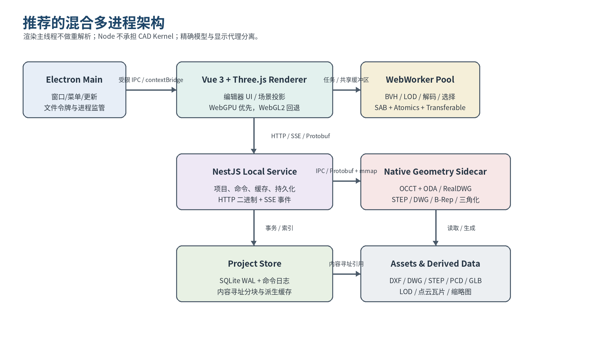

# 3. 总体架构设计



## 3.1 架构总览

系统采用六层逻辑架构：

1. Electron 主进程与 preload 安全桥；
2. Vue 编辑器与 Three.js 渲染内核；
3. WebWorker 前端计算池；
4. NestJS 本地服务；
5. Native Geometry Sidecar；
6. SQLite/CAS 项目存储与派生资产仓库。

## 3.2 进程职责

| 进程 | 职责 | 约束 |
|---|---|---|
| Electron Main | 窗口/菜单、系统对话框、最近文件、更新、签名校验、utilityProcess/侧车监管 | 不得直接解析大文件；不得向 renderer 暴露任意 `fs`、`shell` 或 `ipcRenderer` |
| Renderer | Vue UI、编辑器状态、Three 场景投影、交互、命令预览、GPU 资源管理 | 主线程每帧预算优先；禁止同步解码和同步序列化大对象 |
| WebWorkers | BVH、选择集、属性重排、LOD、轻量解析、压缩解码、几何统计 | 经 Scheduler 分配；使用 Transferable/SAB，支持取消与心跳 |
| NestJS Utility Process | 项目、命令日志、导入任务、缓存、HTTP/SSE、后端插件 | 绑定 `127.0.0.1` 随机端口；重计算转发至侧车或 worker_threads |
| Native Geometry Sidecar | STEP/DWG 读取、B-Rep 运算、精确测量、三角化、点云预处理 | 独立可执行文件，避免 Electron Node ABI 绑定；崩溃可重启 |

## 3.3 通信拓扑

### Renderer ↔ NestJS

- 使用同源本地 HTTP。
- 命令、查询和小型二进制使用 `application/x-protobuf`。
- 大型几何资源通过分块 HTTP、流式 fetch 或本地内容寻址资源获取。
- 长任务状态通过 SSE 发送。

### Renderer ↔ Electron Main

- preload/contextBridge 只暴露 `openFileDialog`、`saveFileDialog`、`revealInFolder`、`windowControl`、受控文件令牌等最小 API。
- 不向 renderer 暴露任意路径读写能力。

### NestJS ↔ Native Sidecar

- 控制面使用长度前缀 Protobuf 帧。
- 大数据优先通过内容寻址文件、mmap、共享内存描述符或临时文件句柄传递。
- 所有请求包含 request ID、deadline、cancel token、资源预算和协议版本。

### Renderer ↔ Worker

- 使用 `MessagePort` + Transferable。
- 热点共享数据使用 `SharedArrayBuffer`。
- 结果以不可变 BufferView/Accessor 描述发布。

> **SSE 边界：** SSE 是文本事件流，二进制 Protobuf 需要 Base64，体积增加且缺少适合大块数据的背压机制。因此 SSE 只承载 `task.progress`、`document.revision`、`resource.invalidated` 等小事件。

## 3.4 文档与渲染投影

- 建立 `EngineDocument → RenderProjection` 映射层；`Three.Object3D` 只保存渲染引用和稳定实体 ID。
- 精确模型、显示网格、LOD、分析结果和选取索引均为不同资源类型，以 revision 和 content hash 关联。
- `RendererAdapter`、`ResourceManager`、`PickingSystem`、`OverlaySystem`、`LODManager`、`FrameScheduler` 组成渲染内核。
- 大坐标使用 CPU float64 世界坐标 + GPU float32 局部坐标，并通过 floating origin/rebasing 避免抖动。

## 3.5 核心数据流

```text
本地文件令牌
   ↓
ImportJob → 格式探测 → 解析器/侧车
   ↓
Document Entity + Exact Asset + Display Proxy
   ↓
SQLite 事务 + CAS Chunk
   ↓
Manifest/粗 LOD 首屏
   ↓
相机驱动细 LOD、BVH、点云瓦片加载
   ↓
用户命令 → 事务提交 → revision 增长 → invalidation
   ↓
只重建受影响的 RenderProjection 与 GPU 资源
```

## 3.6 部署形态

- **V1：** Electron 内置 NestJS 本地服务和原生侧车，离线优先。
- **后续：** 协议和任务接口保持网络透明，可将 NestJS/侧车部署到远程工作站或服务器。
- renderer 不直接感知本地或远程后端，只依赖版本化 API、资源 URL 和能力协商。
